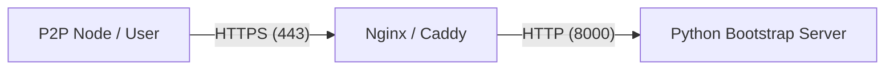

# Deployment Guide - Bit Politeia Bootstrap Server

## 1. Public Network & SSL Certificates

### Can I use the self-signed certificate?
**Technically Yes, but Practically No.**

-   **Pros**: Free, easy to generate (as we just did).
-   **Cons**:
    -   **Trust Issues**: Every client (browser, mobile app, other python node) will reject the connection unless you manually disable verification (`verify=False`) or install the CA certificate on every device.
    -   **Security Risk**: Disabling verification makes you vulnerable to Man-in-the-Middle (MitM) attacks.
    -   **User Experience**: Users will see "Not Secure" warnings.

### Recommended Solution
Use a **Reverse Proxy** (Nginx or Caddy) with **Let's Encrypt** (Free, automated, trusted SSL).

## 2. Deployment Architecture



## 3. Step-by-Step Deployment (Ubuntu/Debian)

### A. Prerequisites
-   A specific domain name (e.g., `bootstrap.bitpoliteia.com`) pointing to your server IP.
-   Access to the server via SSH.

### B. Run the Python Application as a Service
Don't use `python run_bootstrap.py` directly in production. Use `systemd`.

1.  **Create Service File**: `/etc/systemd/system/bit-politeia.service`
    ```ini
    [Unit]
    Description=Bit Politeia Bootstrap Server
    After=network.target

    [Service]
    User=ubuntu
    WorkingDirectory=/home/ubuntu/bit_politeia
    # Run in HTTP mode, let Nginx handle SSL
    ExecStart=/usr/bin/python3 backend/run_bootstrap.py
    Restart=always

    [Install]
    WantedBy=multi-user.target
    ```

2.  **Start Service**:
    ```bash
    sudo systemctl enable bit-politeia
    sudo systemctl start bit-politeia
    ```

### C. Set up Nginx with SSL

1.  **Install Nginx**:
    ```bash
    sudo apt update
    sudo apt install nginx certbot python3-certbot-nginx
    ```

2.  **Configure Nginx**: `/etc/nginx/sites-available/bit-politeia`
    ```nginx
    server {
        server_name bootstrap.bitpoliteia.com;

        location / {
            proxy_pass http://127.0.0.1:8000;
            proxy_set_header Host $host;
            proxy_set_header X-Real-IP $remote_addr;
            proxy_set_header X-Forwarded-For $proxy_add_x_forwarded_for;
            proxy_set_header X-Forwarded-Proto $scheme;
            
            # WebSocket Support (for Gateway capability)
            proxy_http_version 1.1;
            proxy_set_header Upgrade $http_upgrade;
            proxy_set_header Connection "upgrade";
        }
    }
    ```

3.  **Enable Configuration**:
    ```bash
    sudo ln -s /etc/nginx/sites-available/bit-politeia /etc/nginx/sites-enabled/
    sudo nginx -t
    sudo systemctl reload nginx
    ```

4.  **Get SSL Certificate (Auto-Config)**:
    ```bash
    sudo certbot --nginx -d bootstrap.bitpoliteia.com
    ```

## 4. Alternative: Docker Deployment

If you prefer containers, we can provide a `Dockerfile` and `docker-compose.yml`.

### Dockerfile
```dockerfile
FROM python:3.11-slim
WORKDIR /app
COPY backend/requirements.txt .
RUN pip install --no-cache-dir -r requirements.txt
COPY . .
CMD ["python", "backend/run_bootstrap.py"]
```

You would still likely put Nginx in front of Docker, or use a tool like `Traefik`.
